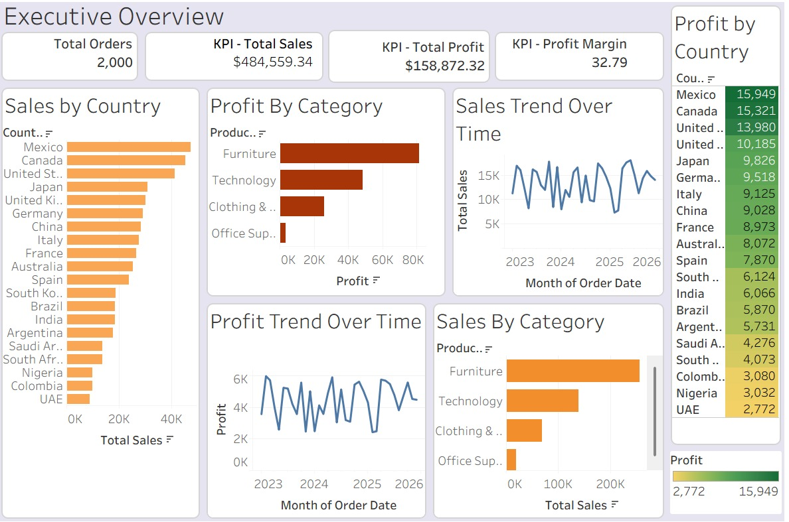
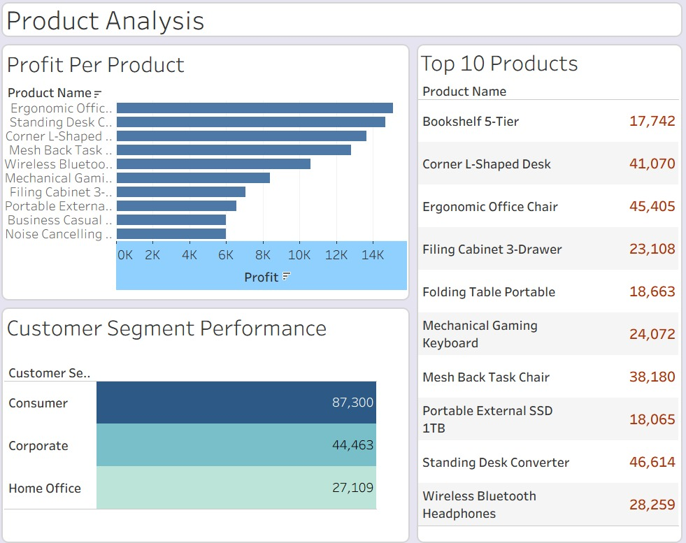
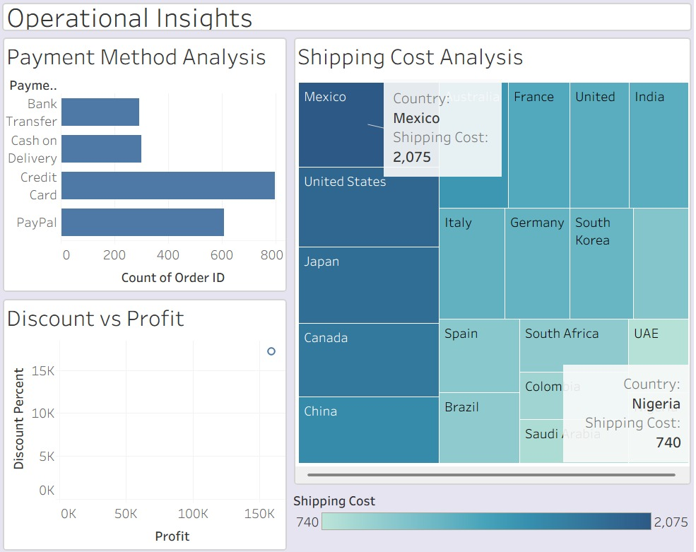

# E-Commerce Executive Dashboard | Tableau

## Project Overview

This project presents a comprehensive Business Intelligence solution built in Tableau using a global e-commerce dataset. The objective was to transform raw transactional data into actionable insights through interactive dashboards and storytelling techniques

The project analyzes sales performance, profitability, customer behavior, product performance, regional trends, and operational efficiency to support data-driven business decisions

---

## Business Problem

E-commerce businesses generate large volumes of transactional data every day. Decision-makers need a centralized view of performance to answer critical questions:

* How much revenue and profit are being generated?
* Which products drive business growth?
* Which customer segments are most valuable?
* Which regions perform best?
* How do discounts affect profitability?
* What operational factors impact performance?

This Tableau solution was designed to answer these questions through visual analytics

---

## Dataset

The dataset contains global e-commerce transactions and includes:

* Order ID
* Order Date
* Customer Name
* Customer Segment
* Country
* Region
* Product Category
* Product Name
* Quantity
* Unit Price
* Discount %
* Total Sales
* Shipping Cost
* Profit
* Payment Method

---

## Tools Used

* Tableau
* Microsoft Excel / CSV
* GitHub

---

📄 Tableau Workbook (.twbx)

[Download Workbook](https://github.com/YourUsername/E-Commerce-Executive-Dashboard/blob/main/E-Commerce-Executive-Dashboard.twbx)

# Dashboard 1: Executive Overview

The Executive Overview dashboard provides a high-level summary of business performance

### KPIs

* Total Sales
* Total Profit
* Total Orders
* Profit Margin %

### Visualizations

* Sales Trend
* Profit Trend
* Sales by Category
* Profit by Category
* Sales by Region
* Profit by Region

### Business Questions Answered

* How much revenue and profit has the company generated?
* Are sales increasing over time?
* Which categories contribute most to revenue?
* Which regions are the most profitable?

**Insights**

The business generated nearly $485K in sales with a strong 32.8% profit margin
Mexico, Canada, and the United States are the leading revenue-generating markets
Furniture is the most profitable product category
Sales and profit trends remain relatively stable throughout the analyzed period
Office Supplies contribute significantly less profit compared to other categories

**Recommendations**

Increase investment in Furniture and Technology products
Expand marketing efforts in top-performing countries
Investigate low-profit categories for optimization opportunities

---

# Dashboard 2: Product & Customer Analysis

This dashboard focuses on understanding customers and products.

### Visualizations

* Top 10 Products
* Top Customers
* Customer Segment Performance

### Business Questions Answered

* Which products generate the most revenue?
* Who are the highest-value customers?
* Which customer segments contribute most to profitability?

**Insights**

*Top Profitable Products*

Leading products include:

* Standing Desk Converter
* Ergonomic Office Chair
* Corner L-Shaped Desk
* Mesh Back Task Chair
* Customer Segment Performance

**Key Findings**

* Furniture products dominate overall profitability
* The Consumer segment contributes the largest share of profits
* A small number of products account for a significant portion of total profit

**Recommendations**

* Prioritize inventory management for high-performing products
* Expand successful furniture product lines
* Develop targeted marketing campaigns for Consumer customers

---

# Dashboard 3: Operational Insights

The Operational Insights dashboard evaluates business operations through payment methods, shipping costs, and discount analysis.

**Payment Method Analysis**

Most frequently used payment methods:

- Credit Card
- PayPal
- Cash on Delivery
- Bank Transfer
- Shipping Cost Analysis

**Countries with the highest shipping costs include:**

* Mexico
* United States
* Japan
* Canada

**Key Findings**

Customers strongly prefer digital payment methods
Shipping expenses are concentrated in high-volume markets
Opportunities exist to improve logistics efficiency and reduce costs

**Recommendations**

* Optimize checkout experiences around preferred payment methods
* Review shipping partnerships and logistics operations
* Analyze discount strategies to maximize profitability
  
---

# Skills Demonstrated

* Data Visualization
* Dashboard Design
* Business Intelligence
* KPI Development
* Customer Analytics
* Product Analytics
* Profitability Analysis
* Geographic Analysis
* Tableau Storytelling
* Data-Driven Decision Making

---

# Conclusion

The analysis reveals a profitable retail business generating $484.6K in sales and $158.9K in profit, achieving a healthy 32.8% profit margin. 
Furniture products drive profitability, while Mexico, Canada, and the United States represent the strongest markets. Customer purchasing behavior favors digital payment methods, and operational analysis highlights opportunities for shipping cost optimization. These insights provide a foundation for improving profitability, operational efficiency, and long-term business growth.

---

## Author

Dési Essis

MBA Candidate | Data Analytics & AI Enthusiast

GitHub: https://github.com/EssisDez
